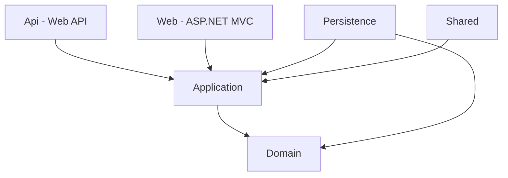

# Artemis Banking Pro (ABP) 🚀

Artemis Banking Pro (ABP) es una plataforma integral de banca digital diseñada para gestionar operaciones financieras clave. Permite la administración completa de usuarios, cuentas de ahorro, préstamos, tarjetas de crédito, beneficiarios, transferencias, depósitos, retiros y pasarelas de pago externas.

El proyecto está construido bajo una **Arquitectura Limpia (Clean Architecture)** en **.NET 9**, garantizando escalabilidad, mantenibilidad y desacoplamiento de componentes.

---

## 🏗️ Arquitectura del Proyecto

El sistema se divide en las siguientes capas lógicas:



1. **[Domain](file:///home/gbria/projects/p3/ArtemisPro/Domain)**: Define el núcleo del negocio. Contiene las entidades (`SavingsAccount`, `CreditCard`, `Loan`, `Transaction`, `ApplicationUser`, etc.), enums y tipos comunes sin dependencias de frameworks externos.
2. **[Application](file:///home/gbria/projects/p3/ArtemisPro/Application)**: Contiene las reglas del negocio, interfaces de servicios, DTOs, validaciones, mapeos y lógica de procesamiento. Define la interfaz del repositorio que se implementará en la persistencia.
3. **[Infrastructure](file:///home/gbria/projects/p3/ArtemisPro/Infrastructure)**:
   - **[Persistence](file:///home/gbria/projects/p3/ArtemisPro/Infrastructure/Persistence)**: Implementación de Entity Framework Core, repositorios concretos, configuraciones de entidades (`Fluent API`), migraciones y siembra de datos semilla (`Seeds`).
   - **[Shared](file:///home/gbria/projects/p3/ArtemisPro/Infrastructure/Shared)**: Implementa utilidades comunes de infraestructura, como la generación de JWT y el envío de correos por SMTP.
4. **[Api](file:///home/gbria/projects/p3/ArtemisPro/Api)**: Proyecto Web API expuesto para integraciones de comercios externos, procesamiento de pagos (Hermes Pay) y consumo administrativo externo. Autenticado mediante JWT.
5. **[Web](file:///home/gbria/projects/p3/ArtemisPro/Web)**: Aplicación web interactiva basada en ASP.NET Core MVC con autenticación basada en Cookies de Identity y diseño responsivo estructurado por roles de usuario.

---

## 🔑 Variables de Entorno y Configuración

El proyecto utiliza variables de entorno cargadas a través de la librería `DotNetEnv`. Los archivos `.env` deben ubicarse en la raíz de los proyectos ejecutables (**Api** y **Web**) o en la raíz general según el entorno de ejecución.

### Archivos de Plantilla (`.env.example`) creados:
- **[Raíz (.env.example)](file:///home/gbria/projects/p3/ArtemisPro/.env.example)**: Plantilla global con todas las variables configurables.
- **[Api/.env.example](file:///home/gbria/projects/p3/ArtemisPro/Api/.env.example)**: Variables específicas requeridas para levantar la Web API.
- **[Web/.env.example](file:///home/gbria/projects/p3/ArtemisPro/Web/.env.example)**: Variables requeridas por la aplicación Web de cara al usuario.

### Parámetros de Configuración:

| Variable | Descripción | Ejemplo / Valor por defecto |
| :--- | :--- | :--- |
| `DB_CONNECTION_STRING` | Cadena de conexión para SQL Server / LocalDB | `Server=localhost\SQLEXPRESS;Database=ArtemisProDb;Trusted_Connection=True;TrustServerCertificate=True;` |
| `JWT_KEY` | Clave secreta simétrica para firma y verificación de JWT (mínimo 32 caracteres) | `your_super_secret_jwt_key_that_is_at_least_32_characters_long` |
| `JWT_ISSUER` | Emisor legítimo del token JWT | `ArtemisProApi` |
| `JWT_AUDIENCE` | Audiencia destinataria del token JWT | `ArtemisProWebClient` |
| `SMTP_HOST` | Dirección del host SMTP para notificaciones por correo | `smtp.mailtrap.io` |
| `SMTP_PORT` | Puerto SMTP utilizado | `2525` |
| `SMTP_USER` | Usuario SMTP autenticado | `tu-usuario-smtp` |
| `SMTP_PASSWORD` | Contraseña de autenticación SMTP | `tu-contraseña-smtp` |
| `SMTP_SENDER_NAME` | Nombre visible que firma los correos enviados | `Artemis Banking Pro` |

---

## 🛠️ Requisitos Previos

Asegúrate de contar con las siguientes herramientas en tu entorno local:

- **.NET SDK 9.0** o superior.
- **Microsoft SQL Server** (LocalDB, Express o Enterprise).
- Un servidor SMTP para pruebas de correos (se recomienda **Mailtrap** para pruebas en desarrollo).

---

## 🚀 Instalación y Puesta en Marcha

### 1. Clonar el repositorio y acceder a él
```bash
git clone <url-del-repositorio>
cd ArtemisPro
```

### 2. Configurar las variables de entorno
Crea un archivo `.env` en los directorios de los proyectos ejecutables copiando las plantillas de ejemplo:

```bash
# Para el API
cp Api/.env.example Api/.env

# Para la Web MVC
cp Web/.env.example Web/.env
```

Asegúrate de editar los valores de los archivos `.env` recién creados con los accesos reales a tu base de datos y credenciales SMTP.

### 3. Restaurar dependencias del proyecto
Ejecuta la restauración de paquetes NuGet en la raíz de la solución:
```bash
dotnet restore
```

### 4. Aplicar Migraciones y Crear la Base de Datos
El proyecto tiene las migraciones configuradas en la capa de persistencia. Puedes aplicar las migraciones directamente ejecutando el siguiente comando apuntando al proyecto de inicio (`Api` o `Web`) y al proyecto de persistencia (`Persistence`):

```bash
dotnet ef database update --project Api --startup-project Api
# o alternativamente con el proyecto Web:
dotnet ef database update --project Infrastructure/Persistence --startup-project Web
```

> [!NOTE]
> Al iniciar la aplicación por primera vez, el sistema ejecutará automáticamente la siembra de datos semilla (`Seeds`) configurando los roles iniciales (`Administrador`, `Cajero` y `Cliente`) y los usuarios por defecto para pruebas.

### 5. Ejecutar los Proyectos

Puedes ejecutar los proyectos por separado utilizando el CLI de .NET:

* **Ejecutar la Web API (Backend & Swagger)**:
  ```bash
  dotnet run --project Api
  ```
  La API estará disponible por defecto en [http://localhost:5000](http://localhost:5000) o a través de los puertos HTTPS configurados en `launchSettings.json`. Puedes interactuar con la API accediendo a `/swagger`.

* **Ejecutar el Portal Web (MVC)**:
  ```bash
  dotnet run --project Web
  ```
  El portal estará disponible en [http://localhost:5001](http://localhost:5001) o puertos aleatorios. Redirigirá automáticamente a la pantalla de login `/Account/Login`.

---

## 👥 Estructura de Roles y Accesos

El sistema cuenta con un sistema de autorización basado en tres roles diferenciados:

1. **Administrador**:
   - Dashboard con indicadores económicos y demográficos generales del sistema.
   - Creación y edición de usuarios (Administradores, Cajeros, Clientes).
   - Asignación y apertura de productos financieros (Cuentas de Ahorro, Préstamos, Tarjetas de Crédito).
2. **Cajero**:
   - Operaciones presenciales directas en ventanilla.
   - Procesamiento de Depósitos y Retiros en cuentas de ahorro.
   - Cobro/Pago a Tarjetas de Crédito y Préstamos activos.
   - Transacciones directas hacia cuentas de terceros.
3. **Cliente**:
   - Portal web personal interactivo.
   - Consulta de productos financieros activos (balances, deudas y últimos movimientos).
   - Administración de beneficiarios favoritos.
   - Realización de transferencias bancarias entre cuentas propias y a terceros.
   - Avances de efectivo (traspaso de saldo de tarjetas de crédito hacia la cuenta de ahorros).

---

## 📄 Documentación Adicional

Para un análisis a profundidad sobre los requisitos del negocio, reglas de cobros de intereses, límites de transacciones y los endpoints detallados de la API de Comercios (**Hermes Pay**), consulta el [Documento Funcional Oficial](file:///home/gbria/projects/p3/ArtemisPro/documento-funcional.md).
